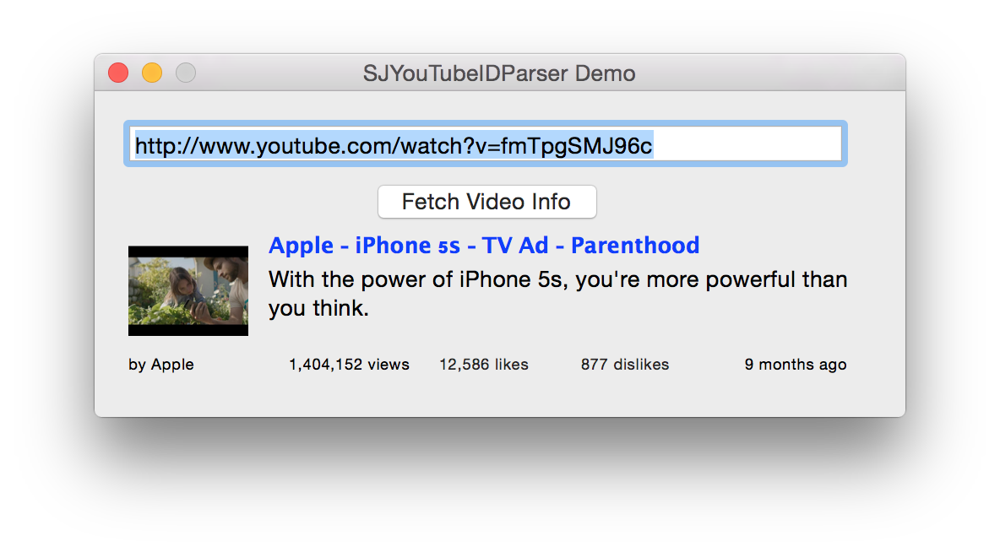

SJYouTubeIDParser
=================

A small useful library to extract or parse out the YouTube Video ID from any YouTube URL. You can also use it to fetch information about a YouTube video e.g upload date, title, and thumbnail URL etc...



## Requirements
- [AFNetworking](https://github.com/AFNetworking/AFNetworking)
- Runs on iOS 6.0 and later
- Runs on OS X 10.8 and later

## Usage

```
#import "SJYouTubeIDParser.h"
#import "AFNetworking.h"

```
## Get Video Identification
```objc
 SJYouTubeIDParser *youtubeVideoID = [SJYouTubeIDParser defaultParser];
    [youtubeVideoID extractYoutubeID:@"YouTube URL GOES HERE"];
    //This will return a 11 characters Video Identification e.g: w87fOAG8fjk

```

You can also use the new block method

```objc
    SJYouTubeIDParser *youtubeParser = [SJYouTubeIDParser defaultParser];
      [youtubeParser getVideoIDWithURL:@"http://www.youtube.com/watch?v=fmTpgSMJ96c" completionHandler:^(NSString *videoID, NSError *error) {
        
        if (error == nil) {
            // No error
            NSLog(@"Video ID is: %@",videoID);
        } else{
            //Handle error (Video is not a valid YouTube URL)
        }
        
    }];
```
## Get information about a YouTube Video
**Note**:The block will be called on a BACKGROUND THREAD, so you need to dispatch UI updates onto the main thread.
``` objc
    [youtubeParser getVideoInfoFromURL:@"http://www.youtube.com/watch?v=fmTpgSMJ96c" completionHandler:^(NSString *videoID, NSString *videoTitle, NSURL *thumbnailURL, NSString *videoDescription, NSString *viewCount, long long rating, NSDate *uploaded, NSString *uploader, NSError *error) {
        
        if (error == nil) {
            // No error
            //you can now get YouTube video's
            //video ID, thumbnail URL, video description, view count,rating, upload date, and the uploader

        
        } else{
            //Handle error
        }
        
    }];
 ```

## Supported video URLs are:

- http://www.youtube.com/watch?v=sapuE9Cui0g&feature=youtu.be
- http://www.youtube.com/watch?v=sapuE9Cui0g
- youtu.be/KFPtWedl7wg_U923
- http://www.youtube.com/watch?feature=player_detailpage&v=sapuE9Cui0g_U#t=31s